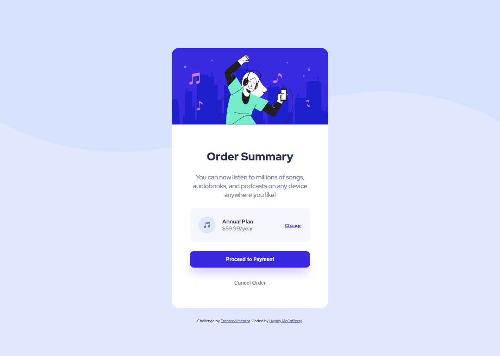

# Order Summary Component

Challenge from [Frontend Mentor](https://www.frontendmentor.io/)

## Usage

The purpose of this project was to practice HTML and CSS skills with a design
from Frontend Mentor challenge

## Challenge Description

"A perfect project for newbies who are starting to build confidence with
layouts!"

## Tech Stack

**Client:** HTML, CSS

## Authors

- [@haylzrandom](https://www.github.com/haylzrandom)

## Acknowledgements

- [Order Summary Component](https://www.frontendmentor.io/challenges/order-summary-component-QlPmajDUj)

## Related

Here are some related projects:

**Coming Soon!**

## Screenshots

## Future Improvements

- [ ] Mobile Design Implemented
